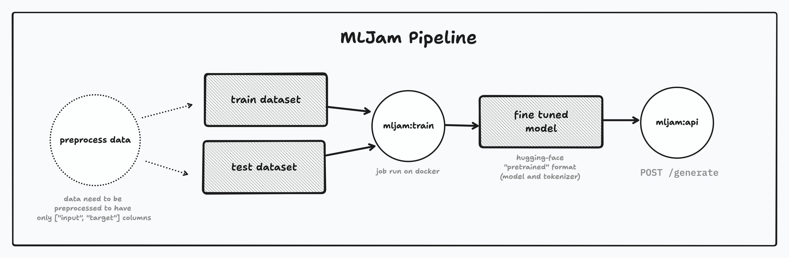
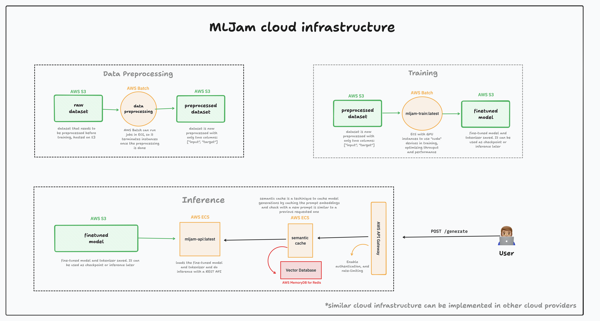

# iFood ML Engineer Test



Challenge description can be found on `challenge.md`. The proposed "framework" is baptized as **MLJam** and is divided into two main components:
- `train/` -> Seq2Seq fine-tuning pipeline
- `api/` -> Inference API to serve Seq2Seq models for generation. 

The example used to demonstrate the solution is a a fine tuning of the [flan-t5-small](), an encoder-decoder transformer model, on the Saleforce's [wikisql]() dataset. The model is then used to generate SQL queries from natural language questions.

### Table of Contents

- [iFood ML Engineer Test](#ifood-ml-engineer-test)
    - [Table of Contents](#table-of-contents)
  - [History](#history)
    - [Choosing the model](#choosing-the-model)
    - [Chosing the dataset and task](#chosing-the-dataset-and-task)
    - [Choosing the inference engine](#choosing-the-inference-engine)
  - [Data preprocessing](#data-preprocessing)
  - [Training](#training)
    - [Usage](#usage)
    - [Future improvements](#future-improvements)
  - [Inference API](#inference-api)
    - [Usage](#usage-1)
    - [Future improvements](#future-improvements-1)
  - [Cloud infrastructure architecture](#cloud-infrastructure-architecture)
    - [Data preprocessing](#data-preprocessing-1)
    - [Training](#training-1)
    - [Inference](#inference)
  - [Run the demo](#run-the-demo)
    - [Training](#training-2)
    - [Inference](#inference-1)
  - [Challenge Feedback](#challenge-feedback)

## History

### Choosing the model

I'm quite interested in AI research, specially on open-source LLMs. Because of this, the first model I was interested on fine-tuning was a open-source LLM that was possible to run in my current environment, a Macbook with Apple Silicon M1, with 16GB of unified memory. I've managed to run many open-source LLMs in this computer (llama2, llama3, mistal, phi-2, phi-3...) using [ollama](https://github.com/ollama/ollama), which is a great tool built with Go to run LLMs in a local environment, using [llama.cpp](https://github.com/ggerganov/llama.cpp) as the backend. I knew the training would require at least the double amount of memory to store the gradients during backpropation, so I knew I had to choose a smaller model to fine-tune. Since I became quite interested in the [Microsoft's Phi](https://github.com/microsoft/Phi-3CookBook) models and its [research used to build a small LLM](https://arxiv.org/abs/2306.11644), I tried to load this model for fine-tuning. However, the model was too big to fit in my computer's memory. Also, the model was too recent by the time I began to implement this challenge, so there were no proper instructions to fine-tune it, and inference was not compatible with `llama.cpp` yet, which is the tool I intended to use to run the model. So I knew I had to search for pre-established models that were much smaller in size to be able to train in my current environment, like [BART](https://huggingface.co/docs/transformers/en/model_doc/bart).

I talked with a greek friend of mine which is doing academic AI research on fine-tuning generative models for summarization, and he suggested gon then tried to fine-tune Google's T5 models, which were better alternative than BART itself for being a more recent research release. I chose [flan-t5-small](https://huggingface.co/flan-t5-small) model, which is a small version of the `flan-T5` model, fine-tuned in summarization and translation for a few languages and it worked. The next thing was selecting the task to finetune the model to generate.

### Chosing the dataset and task

At first, I wanted to fine-tune a model for code generation from instructions, like Meta's CodeLlama and OpenAI Codex. So I've started using [iamtarun/python_code_instructions_18k_alpaca](https://huggingface.co/datasets/iamtarun/python_code_instructions_18k_alpaca), but since T5 models were pretrained on a summarization and translation tasks, the results were not getting very good. I then tried aimimg towards a more "translational" task. I then used [wikisql](https://huggingface.co/datasets/wikisql) dataset, which is a dataset for generating SQL queries from natural language questions. The results were much better, so I decided to stick with this dataset for the fine-tuning task.

### Choosing the inference engine

The thing that I was most excited about was to optmize the model inference by using a low level implementation of the model architecture or even weights quantitization, like `llama.cpp`, or `ollama` to make it running and deplpying even faster, by using a C++ backend. `ollama` already comes with a OpenAI compatible server, so it would be very easy to deploy the model in a production environment and increase of users adoption with a familiar API. T5 is not considered an LLM model itsel, but a Seq2Seq model, so it was not compatible with `llama.cpp` yet. However, recently, there's been development (both on [weights conversion](https://github.com/ggerganov/llama.cpp/pull/8055) and [inference](https://github.com/ggerganov/llama.cpp/pull/8141)) on implemeting T5 architecture in `llama.cpp` so it will possible to do fast inference using low level operations in C++. So at the time, I thought I could convert the trained T5 model to `.gguf` and run in `ollama` by creating a custom mode (even done a quantitization to `q8` using [llama.cpp's script](https://github.com/ggerganov/llama.cpp/blob/master/convert-hf-to-gguf.py)), following this [guide](https://github.com/ollama/ollama/blob/main/docs/modelfile.md), load the model and try inference. However, even that the weights were correctly read, T5 model architecture was not compatible with the current `llama.cpp` implementation in `ollama`. So I tried to run on `llama.cpp` itself, but only the model conversion was possible, not the inference, since the development was still going on. 

Because of this, and the tight deadline, I decided to use a high-level implementation of the model, like `hugging-face`'s `transformer` library [pipeline construct](https://huggingface.co/docs/transformers/en/main_classes/pipelines). I then decided to serve using `fastapi` to build the API, since it is a very fast and easy to use framework, with a built-in Swagger documentation.

## Data preprocessing

Data preprocessing is a very important step in the training pipeline, but it was not the considered part of this challenge. The data should be preprocessed in a way that the training pipeline can find the input an targets, as well split for training the test. **The training pipeline requires the dataset to have to columns, `input` and `target`, and need to be formatted as that**. For the demonstration, implemented in `train/dataset.py`, I've used the `wikisql` dataset, which is already preprocessed and split in the `train_data` and `test_data` directories, but has different columns, so it's formatted with only two columns and a prefix to better get better accuracy on a new task (T5 models define the task in the prefix of the input).

## Training

Models classified as `Seq2Seq` are models that are used for sequence-to-sequence tasks, such as translation, summarization, and question-answering. These models are usually pre-trained on large datasets and then fine-tuned on a specific dataset for a specific task. The fine-tuning process on this training pipeline is done by defining a max number of iterations. The model then trained for the specified number of iterations and then saved to a specified path. All training data should be in the `train_data` directory and the test data should be in the `test_data` directory. The model is then fine-tuned using `hugging-face`'s `transformer` library.

### Usage
You can run the model by running the container with the following arguments:
- `MODEL_ID`: desired `hugging-face` model ID to be fine-tuned. Default value is `google/flan-t5-small`.
- `TRAIN_DATA_PATH`: The path to the training data. Default value is `/app/shared/data/train_data`.
- `TEST_DATA_PATH`: The path to the test data. Default value is `/app/shared/data/test_data`.
- `BATCH_SIZE`: The batch size for training. Default value is 1.
- `SAVE_MODEL_PATH`: The path to save the trained model. Default value is `/app/shared/models/saved_model`.
- `DEVICE`: The device to be used for training. Default value is `cpu`.
- `ITERATIONS`: The number of training iterations. Default value is 10.

A volume is needed to access the training data and also to save the model once the fine-tuning is done. Then, run the docker container with the following command:

```bash
# first, build the image
docker build /train -t  mljam-train:latest
# then, run the container
docker run -v $(pwd)/shared:/app/shared -e MODEL_ID="google/flan-t5-small" -e TRAIN_DATA_PATH="/app/shared/data/train_data" -e TEST_DATA_PATH="/app/shared/data/test_data" -e BATCH_SIZE=1 -e SAVE_MODEL_PATH="/app/shared/models/saved_model" -e DEVICE="cpu" -e ITERATIONS=10 mljam-train:latest
```

The model is then saved to the specified path, both the model itself and the tokenizer. This is important so it can be later be loaded by the inference API.

### Future improvements

Currently, the training step seems to work only with `BATCH_SIZE=1`. I left like this because of two reasons: my machine has only 16GB of memory and training the model a bigger batch size would run the amount of memory in the middle of the training. Also, to correctly use increased batch sizes, only increasing the number was not sufficient, because even that the inputs and outputs are padded, the tensor sizes were mismatching mid-training. This might be related to the max number of tokens generated, but also because a training configuration with a DataCollator did not worked properly. I managed to train with larger batch sizes in a development configuration using a rented Deep Learning rig in vast.ai (2x RTX 3090), but couldn't manage to achieve the same result again.

I lost a lot of time making model evaluation work, but I was not able to. The issue was related to tensors sizes again, something that might need to be proper configured in the evaluation computing function. So only current metric available to evaluate the model accuracy is training loss, which is logged during traning. Another thing is that the current training docker image might not be well configured to run in CUDA devices, which is the most popular way to train machine learning models, so a proper install of the required libraries for that might be needed.

## Inference API

The inference API is a REST API that serves predictions for a given fine-tuned Generative AI model. Built with [fastapi]() and [hugging-face inference's pipeline](), the endpoints are documented with Swagger. The API loads the model from the specified path and then serves predictions for the given input.

### Usage

You can run the API by running the container with the following arguments:
- `MODEL_PATH`: Specifies the path where the models are stored.
- `DEVICE`: Specifies the device to be used for model execution (defined by [torch.device](https://pytorch.org/docs/stable/tensor_attributes.html#torch.device)).

A volume is needed to access the trained model. Then, run the docker container with the following command:

```bash
# first, build the image
docker build /api -t  mljam-api:latest
# then, run the container
docker run -v $(pwd)/shared:/app/shared -e MODEL_PATH="/app/shared/models/saved_model" -e DEVICE="cpu" -p 8000:8000 mljam-api:latest
```

The model docs can be accessed at `http://localhost:8000/docs`. To generate an example SQL query from a natural language question, you can use build a request in the form:

```sh
curl -X 'POST' \
  'http://127.0.0.1:8000/generate' \
  -H 'accept: application/json' \
  -H 'Content-Type: application/json' \
  -d '{
  "text": "translate to SQL: Tell me what the notes are for South Australia"
}'
```
### Future improvements

The current implementation of the API is very simple and can be improved in many ways to transform in a high-scale production-ready API. Some of the improvements that can be made are:

- Authentication: so only authorized users can access the API;
- Token rate limiting: to avoid abuse of the API and to ensure that the API is available for all users;
- Better configuration for concurrent requests: to ensure that the API can handle multiple requests at the same time;
- Logging and monitoring: to log the requests and responses for debugging and monitoring;
- Improved API (too simple right now): users might want to want other fields such as the embeddings.
- Security: add prompt sanitization and injection prevention to avoid corporate data leaks.

## Cloud infrastructure architecture 



To make it easy to understand the cloud infrastructure architecture, I've divided it into three main components: data preprocessing, training, and inference. Each component has its own requirements and needs to be deployed in a different way. It's possible to make these cloud infrastructure easy to deploy using IaC tools like Terraform or Pulumi. Even though this architcture is designed for AWS, it can be easily adapted to other cloud providers like GCP or Azure. In the context of iFood, ECS could be easily replaced by Kubernetes, since it is the main container orchestration tool used by the company, and the API Gateway could be replaced with Kong, which is the main API Gateway used by the company.

### Data preprocessing

The data preprocessing stage begins with the raw dataset hosted on AWS S3. The raw dataset undergoes preprocessing using [AWS Batch](https://aws.amazon.com/batch/), which runs preprocessing jobs on ECS instances. During this process, tasks such as data cleaning, normalization, and transformation can be performed. Once preprocessing is complete, the dataset is transformed into a format with two columns, ["input", "target"], and stored back on AWS S3. This is necessary because the training pipeline requires the dataset to be in this format. The data preprocessing stage is essential for ensuring that the training pipeline can access the data in the correct format.

### Training

The training phase takes the preprocessed dataset from AWS S3 as input. Training is executed using the Docker container `mljam-train:latest`, created by this solution, and run in AWS Batch. AWS Batch leverages [ECS with GPU instances](https://docs.aws.amazon.com/AmazonECS/latest/developerguide/ecs-gpu.html) to optimize throughput and performance, like [g4dn.12xlarge](https://docs.aws.amazon.com/ec2/latest/instancetypes/ac.html), with 4 Nvidia T4 GPU video cards. The model is fine-tuned using the preprocessed data given the proper hyperparameters for training (batch size, training device like Nvidia's "cuda", iterations...), and the resulting fine-tuned model and tokenizer are saved on AWS S3. These artifacts can be used as checkpoints or for inference in subsequent stages.

### Inference

In the inference stage, the fine-tuned model and tokenizer stored on AWS S3 are loaded into an ECS instance using the the Docker container `mljam-api:latest`, which was built in this framework using `hugging-face` pipeline construct and `fastapi`. Inference is performed through a REST API, and a semantic cache is implemented to enhance efficiency. The semantic cache stores prompt embeddings and checks if a new prompt is similar to a previously requested one, thus reducing redundant computations and responsing faster, since tokenizing is way faster and cheaper then generate new tokens for a given prompt. These embeddings are stored in a vector database, specifically AWS MemoryDB for Redis, which supports [vector search](https://docs.aws.amazon.com/memorydb/latest/devguide/vector-search-overview.html). The generated responses are then served to the user via AWS API Gateway, ensuring scalability and manageability of user interactions. Token limit rate could not be able to be implemted in AWS Gateway, as I'm not sure if it's easy to implement custom rate limiting by executing code in the API Gateway itself. However, it would be possible to build a custom microservice to handle the token rate limiting and deploy it in ECS, and then use the API Gateway to route the requests to this microservice.

## Run the demo

The demo consists in fine-tuning the T5 model on the wikisql dataset to generate SQL queries from natural language questions. The fine-tuned model is then served through a REST API to generate SQL queries from natural language questions.

### Training
To run the training pipeline, you need to have Docker installed in your machine. To make the process faster. The preprocessed data is already present in this repository and the default image parameters are selected to train the demo dataset in a CPU machine. Selecting a low number of iterations might be suitable to check if it's properly working withot wasting a lot of time, so you can run the training pipeline by running the following commands:

```bash
# first, build the image
docker build /train -t  mljam-train:latest
# then, run the container
docker run -v $(pwd)/shared:/app/shared -e ITERATIONS=10 mljam-train:latest
```

### Inference
To run the inference API, you need to have Docker installed in your machine. The default image parameters are selected to run the API in a CPU machine. The model is already fine-tuned and saved in the `shared/models/saved_model` directory. You can run the API by running the following commands:

```bash
# first, build the image
docker build /api -t  mljam-api:latest
# then, run the container
docker run -v $(pwd)/shared:/app/shared -p 8000:8000 mljam-api:latest
```

The API docs is then available at `http://localhost:8000/docs`. You can generate an example SQL query using the Swagger interface.

## Challenge Feedback
- Selecting the models and datasets and making the "framework" as generic as possibl were by far the most time consuming part. Since candidates expect iFood's bar to be very high, they might lose a lot of time trying to make a generic pipeline and creating the best demonstration possible. It's fun, but not suitable for a tight deadline for candidates for the role. I think that the challenge could be more focused on the ML Engineering part, like optimizing training and serving part, and less on the model selection and dataset selection. This would make the challenge more focused on machine learning **engineering** itself and it would extract the full potential of the candidate for the current role. Maybe the challenge could already establish the model and suggested dataset to be used, and the candidate would have to optimize the training and serving part for any dataset. This would make the challenge more focused on the ML Engineering part and would extract the full potential of the candidate for the current role.
- Explore more the performance/scale part of the challenge. I think that the challenge could have a part where the candidate would have to optimize the training and serving part for a specific metric, like latency or throughput. Or quantitize the model to use less memory and run faster.
- My main research background is on cryptography and I would love to have some time to do the Bonus challenges with reverse engineering. Even though is a fun challenge, I think it is not very related to the main task of the challenge, which is to fine-tune a model and serve it in an API, and this can take the ML Engineering part out of focus or even not extracting the full potential of a candidate because he/she would want to get bonus points, taking the time of possible improvent of the ML challenge.